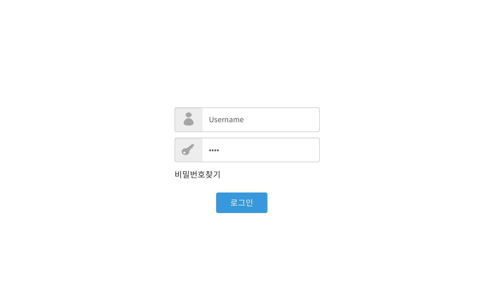

# 주제 선정
- 자가 진단을 통해 client의 레벨을 측정하고, 레벨에 맞는 필름 카메라를 추천해주는 서비스

## 기능
1. 설문을 통한 자가진단
2. 레벨별로 카메라 추천
3. 화면 하단에 오늘의 추천 생성
    - 필터추천 / 날씨에 따라 추천 / 필름추천
	- 필름 카메라는 필름, 스캐너의 성능에 따라 결과가 달라진다.
4. 실력 향상이 되는것을 기본으로 스킬업 미션 (~기능으로 ~ 찍어보기) 
	- 아예 하나의 화면을 생성하는 것도 좋을 것 같다.
5. 사용자 커뮤니티 탭 
    - 서로의 사진을 공유, 투표를 통한 랭킹화(구글 차트 활용 가능)
6. 고수/멘토 매칭 서비스 -> 커뮤니티에서 QnA
	- 답변은 실력자만 가능(레벨 3은 레벨 4의 질문에 답변을 못 단다.)
	- 자주 찾는 질문과 답변을 화면에 고정하는 것도 좋을 것 같다.

## 선택 옵션
- 수동 / 자동
- 목적, 용도(인물/자연 등등)
- 가격대
- 브랜드별로 구분
- 다른 카메라 추천(더 싼거라던지...등등)

## 필수적으로 필요한 기능
- 아래의 항목들은 각자 하나씩 맡아서 기능 구현하기로 한다.
1. 이현수 - 자가진단 질문 선정, 기능 구현
2. 하예진 - 로그인 기능 구현
3. 손유진 - 회원가입 기능 구현
4. 이유경 - css로 전반적으로 사용 될 화면 구성

## DB 초기 설계

## 화면 구상
> 레벨을 측정하는 설문조사 화면

> 회원가입 화면

> 로그인 화면

> 로그인 후 필름카메라를 추천하는 화면

> 왼쪽 하단의 필름 추천을 누르면 나오는 팝업 화면

